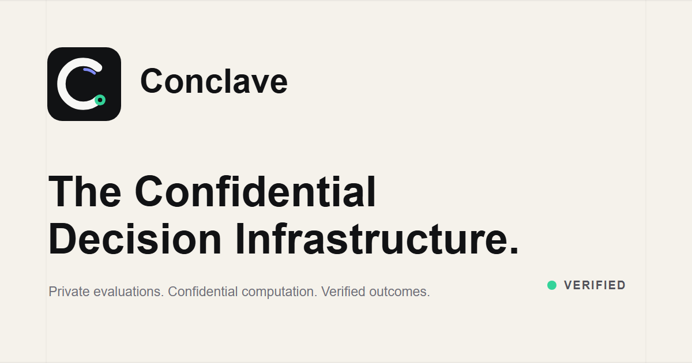

# Conclave



Conclave is confidential decision infrastructure for organizations. Teams
create structured campaigns, assign evaluators, collect Nox-encrypted weighted
scores, and reveal only the verified aggregate result after every required
evaluation is complete.

This repository is an entry for the **iExec WTF Hackathon Summer Edition** and
targets the managed iExec Nox deployment on Ethereum Sepolia.

## Nox Integration

Conclave uses the official Nox toolchain:

- `@iexec-nox/handle` encrypts evaluator scores in the browser.
- `@iexec-nox/nox-protocol-contracts` provides confidential Solidity types and
  operations.
- `@iexec-nox/nox-hardhat-plugin` compiles and optionally tests the contract.
- `ConfidentialDecisionEngine` adds encrypted scores without revealing
  individual values.
- Public-decryption proofs are enabled only after every evaluator has submitted
  once for every submission.
- The contract verifies the proofs, publishes aggregate totals, and selects the
  winner.
- Next.js API routes independently verify Sepolia calldata, receipts, senders,
  and Nox events before writing results to PostgreSQL.

```text
criterion inputs -> normalized weighted score -> Nox encrypted handle
                 -> confidential on-chain aggregation -> verified totals
```

The public chain reveals campaign participation, encrypted handles, final
per-submission totals, and the winner. It does not reveal individual score
values. Free-text private comments are deliberately outside the current Nox
payload because this integration aggregates `uint256` values.

## Product Workflow

1. An administrator creates an organization, template, campaign, and
   submissions.
2. Evaluators accept invitations and link unique Sepolia wallets.
3. The administrator initializes the confidential campaign on-chain.
4. Each evaluator completes every assigned evaluation.
5. The browser encrypts each weighted score and submits it to Nox on Sepolia.
6. After all submissions are complete, the administrator finalizes encrypted
   aggregates and obtains Nox public-decryption proofs.
7. The contract verifies and publishes the result.
8. Conclave verifies the transaction and displays the aggregate ranking.

## Technology

- Next.js 16, React 19, TypeScript, Tailwind CSS
- Supabase Auth, Google OAuth, Storage, and PostgreSQL
- Prisma ORM
- RainbowKit, Wagmi, and Viem
- iExec Nox Handle SDK and confidential contracts
- Hardhat 3 and Solidity 0.8.35
- Zod and React Hook Form

## Prerequisites

- Node.js 22 or 24 LTS
- pnpm 10.13.1
- Supabase project with Google Auth
- Reown project ID
- Ethereum Sepolia RPC URL
- Dedicated wallet funded with Sepolia ETH for contract deployment
- Vercel account for the public deployment

Docker is not required for the managed Sepolia and Vercel workflow.

## Install

Use the pinned pnpm version:

```powershell
npx --yes pnpm@10.13.1 install --frozen-lockfile
Copy-Item .env.example .env
```

Follow [ENVIRONMENT_SETUP.md](./ENVIRONMENT_SETUP.md) to obtain every value.

Prepare the database:

```powershell
npx --yes pnpm@10.13.1 db:generate
npx --yes pnpm@10.13.1 db:deploy
```

Run the application:

```powershell
npx --yes pnpm@10.13.1 dev
```

## Deploy

Deploy `ConfidentialDecisionEngine` to Ethereum Sepolia:

```powershell
$env:SEPOLIA_RPC_URL="https://YOUR_SEPOLIA_RPC_ENDPOINT"
$env:SEPOLIA_PRIVATE_KEY="0xYOUR_FUNDED_DEPLOYER_PRIVATE_KEY"
npx --yes pnpm@10.13.1 deploy:nox:sepolia
```

Add the resulting address to Vercel as
`NEXT_PUBLIC_CONCLAVE_NOX_ADDRESS`, configure the other values from
`.env.example`, and redeploy. The complete deployment and demo steps are in
[WEB3_SETUP.md](./WEB3_SETUP.md).

## Commands

| Command                   | Purpose                                                      |
| ------------------------- | ------------------------------------------------------------ |
| `pnpm dev`                | Start the Next.js development server                         |
| `pnpm build`              | Create a production build                                    |
| `pnpm typecheck`          | Run TypeScript checks                                        |
| `pnpm lint`               | Run ESLint                                                   |
| `pnpm test`               | Run unit tests; no Docker required                           |
| `pnpm compile`            | Compile all Solidity contracts with the Nox plugin           |
| `pnpm test:nox`           | Optional local Nox end-to-end contract test; requires Docker |
| `pnpm deploy:nox:sepolia` | Deploy the confidential engine to Sepolia                    |
| `pnpm db:deploy`          | Apply committed Prisma migrations                            |
| `pnpm db:seed`            | Seed only a controlled development database                  |

## Repository Map

```text
app/                 Next.js pages and verified API routes
components/          Product UI and Nox browser flows
contracts/core/      ConfidentialDecisionEngine and registry contracts
lib/nox/             ABI, score normalization, and Sepolia clients
prisma/              Schema, migrations, and seed script
scripts/             Sepolia deployment scripts
test/unit/           Fast unit tests
test/contracts/      Optional full Nox integration test
```

## Privacy Boundary

Conclave stores:

- public campaign, submission, assignment, and template configuration;
- encrypted Nox handles and proofs;
- transaction hashes and verification metadata;
- verified aggregate totals, rankings, and winner.

Conclave does not store plaintext individual criterion responses or individual
weighted scores. The evaluator's browser temporarily sees its own inputs to
calculate the weighted score, then encrypts that score for the contract.

Final aggregate totals are public by design. This prevents the application
server from inventing a result while preserving the confidentiality of each
evaluator's contribution.

## Existing Work and Hackathon Work

Before the WTF Hackathon integration, Conclave already contained the product
application: Google/Supabase authentication, organizations and roles,
campaigns, submissions, evaluation templates, assignments, storage, Prisma
models, audit logs, and the user interface.

The hackathon work adds the official iExec Nox integration:

- confidential Solidity aggregation contract;
- official Handle SDK input encryption;
- evaluator-wallet authorization;
- Sepolia transaction and event verification;
- proof-based aggregate publication and winner selection;
- verified database result persistence;
- Nox deployment script, unit coverage, optional integration coverage, and
  deployment documentation.

## Hackathon Deliverables

- Functional Next.js front end
- Open-source Solidity and application code
- Managed Nox Sepolia architecture
- Complete environment and deployment guide
- [iExec tooling feedback](./feedback.md)
- MIT license

The public Vercel URL, deployed Sepolia contract address, repository URL, and
four-minute demo video should be added to this README and the submission post
after deployment.

## Verification

Before publishing a deployment:

```powershell
npx --yes pnpm@10.13.1 typecheck
npx --yes pnpm@10.13.1 lint
npx --yes pnpm@10.13.1 test
npx --yes pnpm@10.13.1 compile
npx --yes pnpm@10.13.1 build
```

Never commit `.env`, Supabase service keys, RPC secrets, or wallet private
keys.
